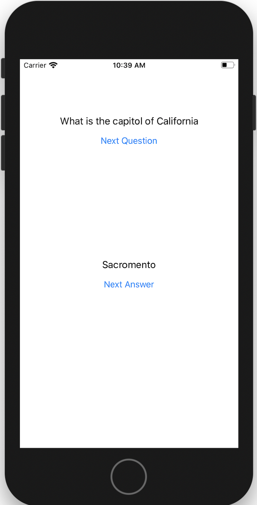

This chapter explores the basic of app development with iOS.

The user is presented with a list of questions and answers.
They could press the next question button to get a new question.
They could press the show answer button to get the answer.

