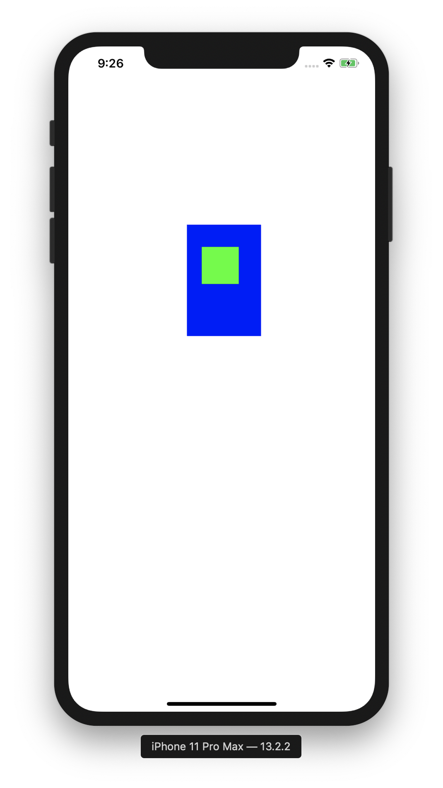
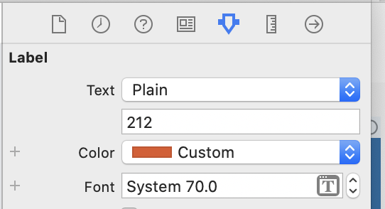
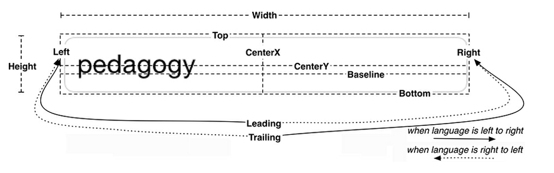
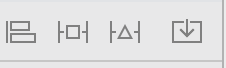
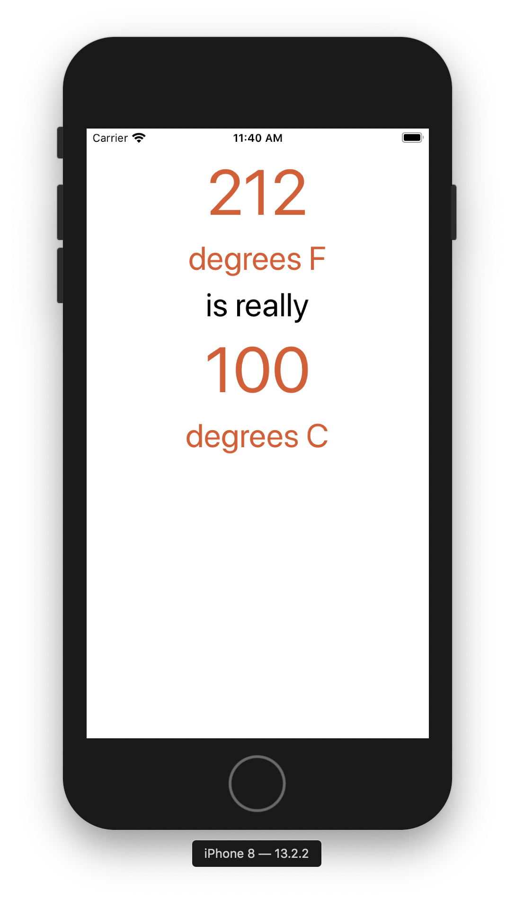

This chapter started by experimenting with UIViews.
A view's frame is relative to its superview and are organized in a heirarchy.

Next it explained how to set the size and font of a Label using the Attributes Inspector

Finally, it explained the Auto Layout System.
The Auto Layout System's basis is the alignment Rectangle

The constains can be set using the constraint menu

The finished product displays five labels that have auto constraints set for central alignment and an eight point spacing
The top most label is constrained to the top of the super view
The rest of the labels have thier top constrained to the bottom of the label above itself

