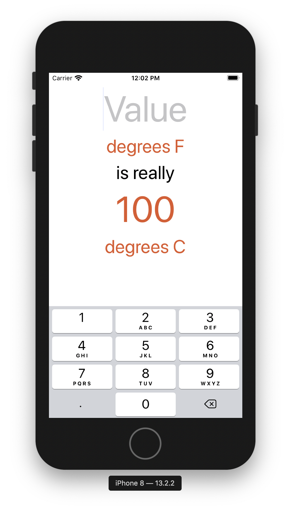
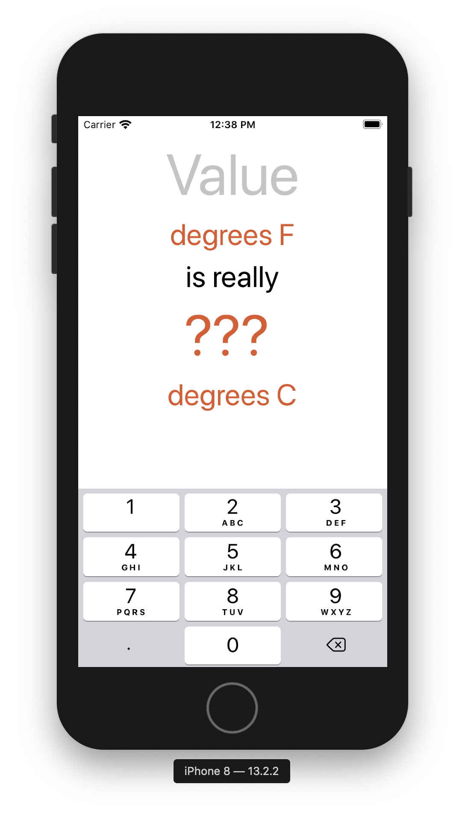
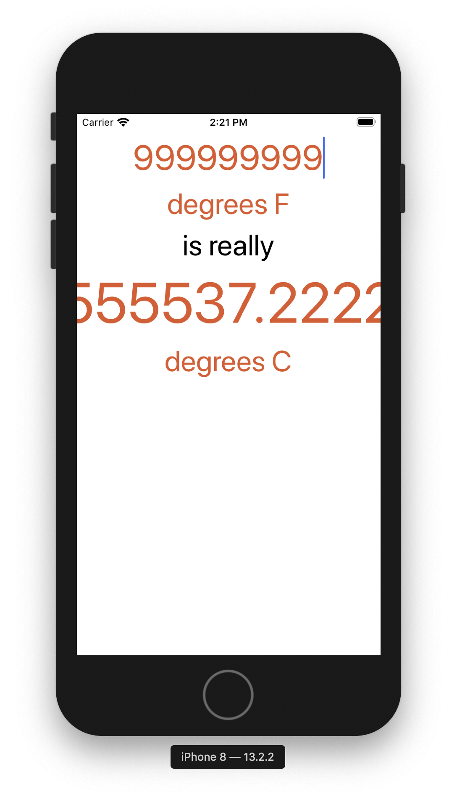
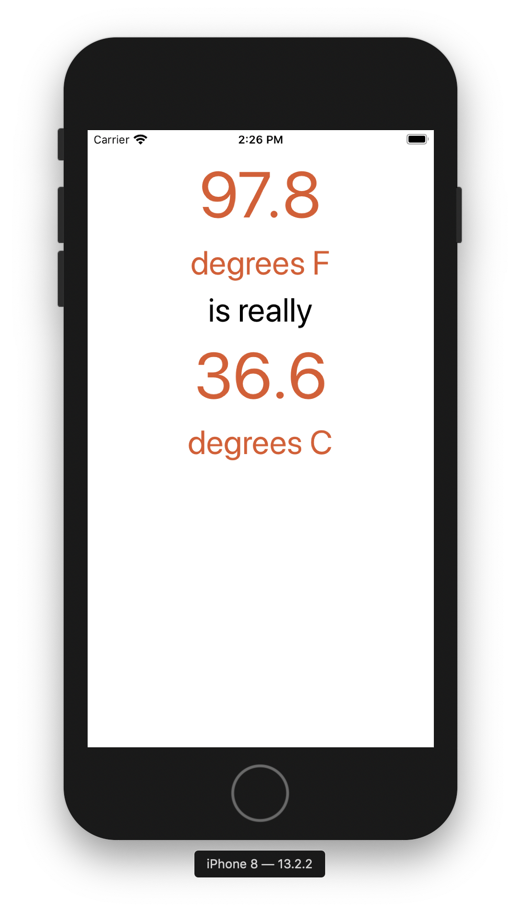

#  Chapter 4

This chapter is going to focus on text inputs and functions.
It starts off by replacing the top most label with a text field and setting the keyboard to digit pad

Next up the text field is connected to the third label such that when a number is typed in the text field,
the label updates to match the current value

Functionality was also included to remove the keyboard when the user taps on the background
This was completed using a TapGestureRecognizer action

The next big step was the function to convert from Fahrenheit to Celsius
Property observers were used to determine when the F value was set by the user
A function was included in the observer that converts the F val to C val
and finally that value was set to the CelsiusLabel

To fix the error with displaying too many decimal places, a min and max was created using a Number
Formatter.

To prevent the user from entering too many radix points, UITextFieldDelegate was used
If one exists, then prevent the update of the input value
