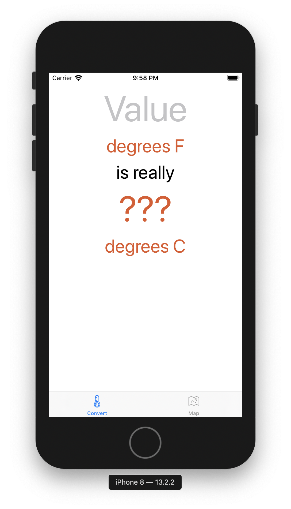
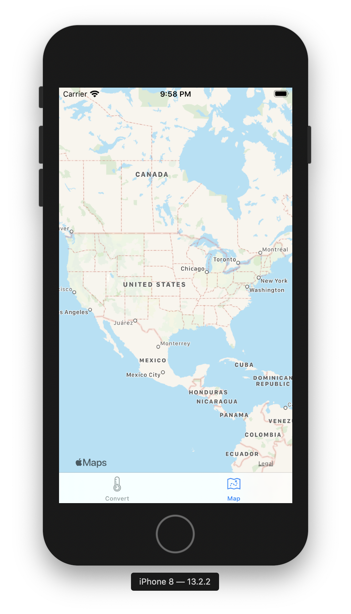

#  Chapter 5

This chapter begins by explaining how to setup an MKMapView
It goes on to explain how a UITabViewController can be used to display two views using lazy loading
Images were added to each BarButtonItem so that both views can be used from one frame

viewDidLoad will occur at the first load while viewWillAppear will occur before every load
