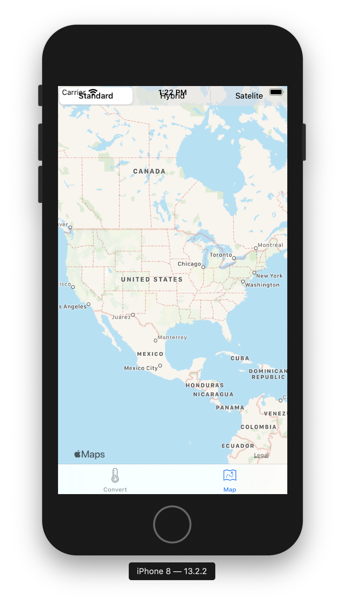
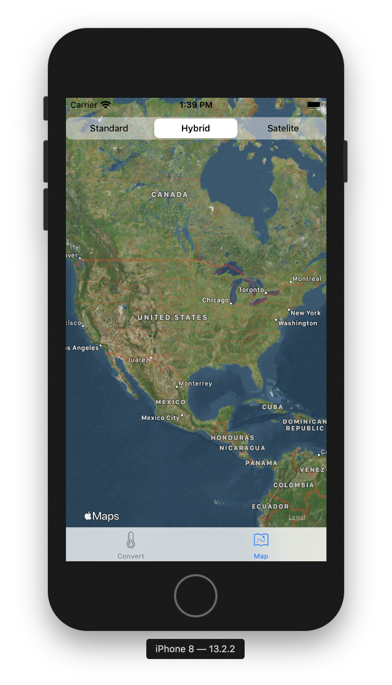

#  Chapter 6

This chapter will focus on recreating the map view programmatically

The chapter discusses how to use UISegmentedControl to allow the user to choose
between standard, hybrid, and satalite map views

Constraints are also set to match the superview's top, leading, and trailing anchor points

Finally, the chapter explains how to call a function to change the map type when the user clicks on
the available three buttons

