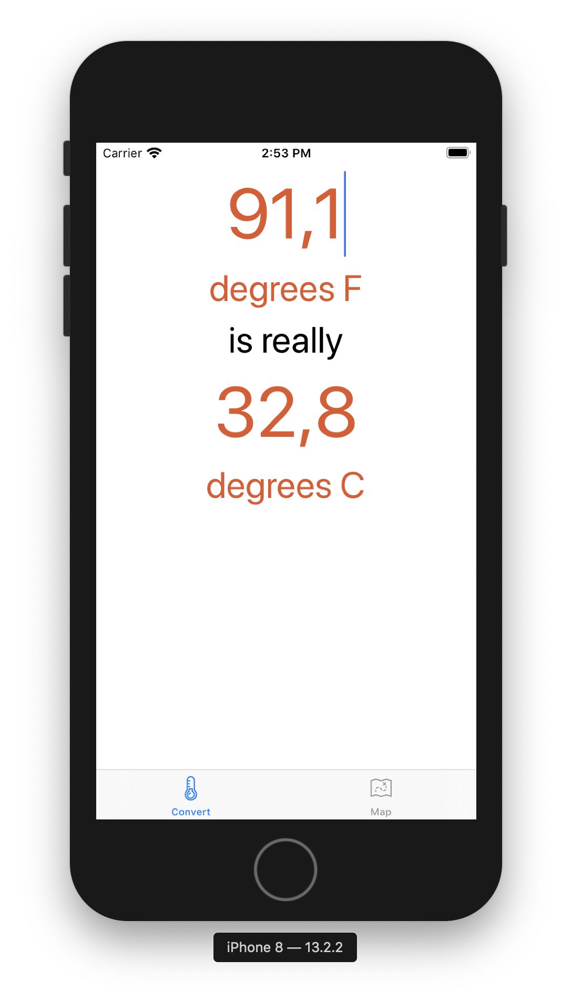
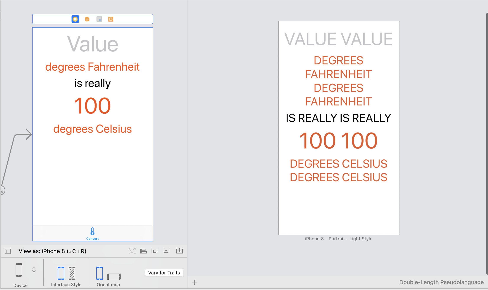
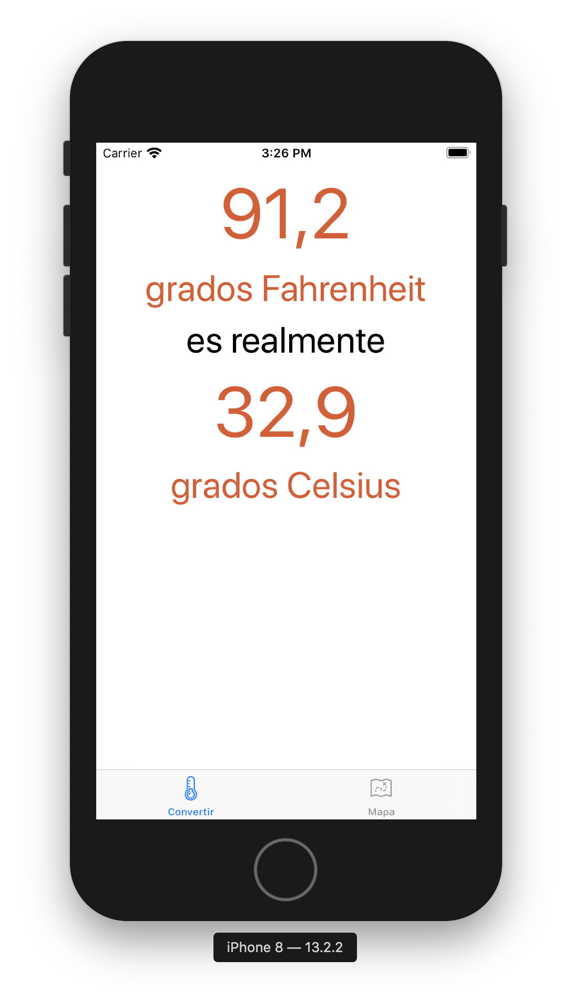
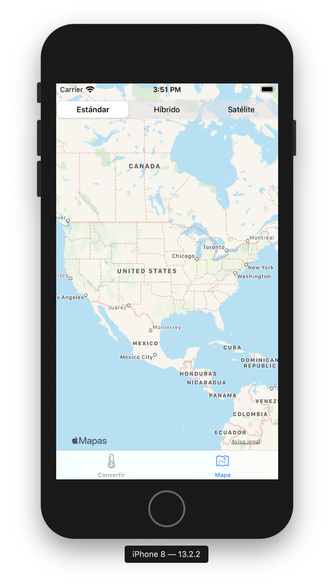

#  Chapter 7

This chapter discuesses internationalization and localization

The functions for converting and displaying are updated
Since some countries use commas in place of a decimal point, we use Number Formatters instead

The chapter goes on to describe how to localize the labels and text fields to support different languages
XCode has a feature called the assistant which will allow the dev to choose a psudo language
This psudolanguage is double the normal text, which will be enough to support any language
Doing this will allow you to see which constraints need to be modified

At this point the Convert portion of the app has the numbers localized and the display localized
Next up the project is converted to support Spanish

A strings table was created and I had to manually translate each static string for each of the text fields
This chapter also shows how to automatically translate strings using NSLocalizedString
The necessary NSLocalaizedString objects were added to the MapView and the following was executed:
genstrings MapViewController.swift
Then I had to manually translate the localization of the strings to Spanish. Now the dynamic strings are
localized

